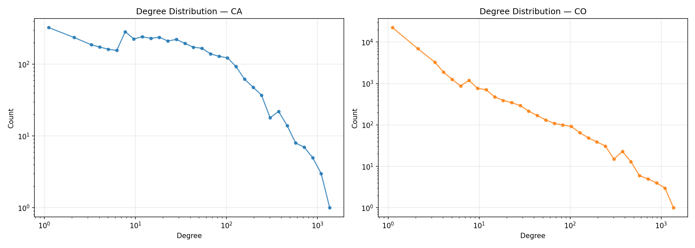
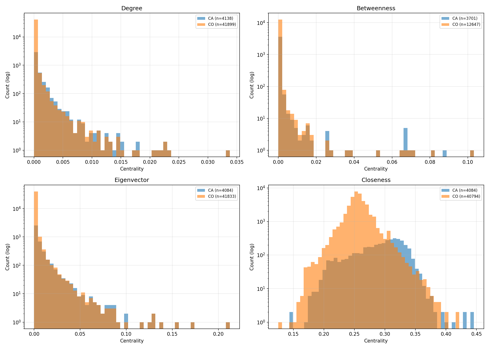
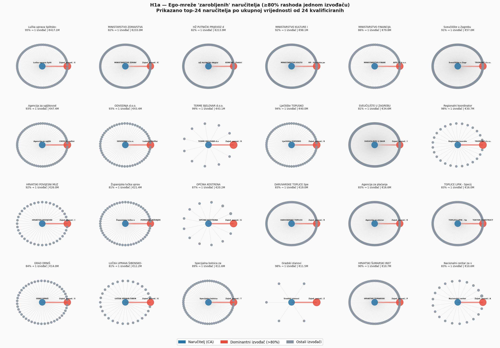
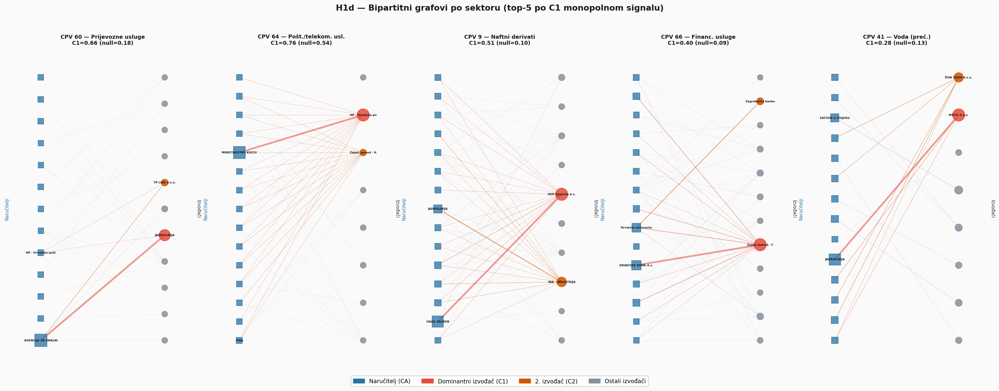
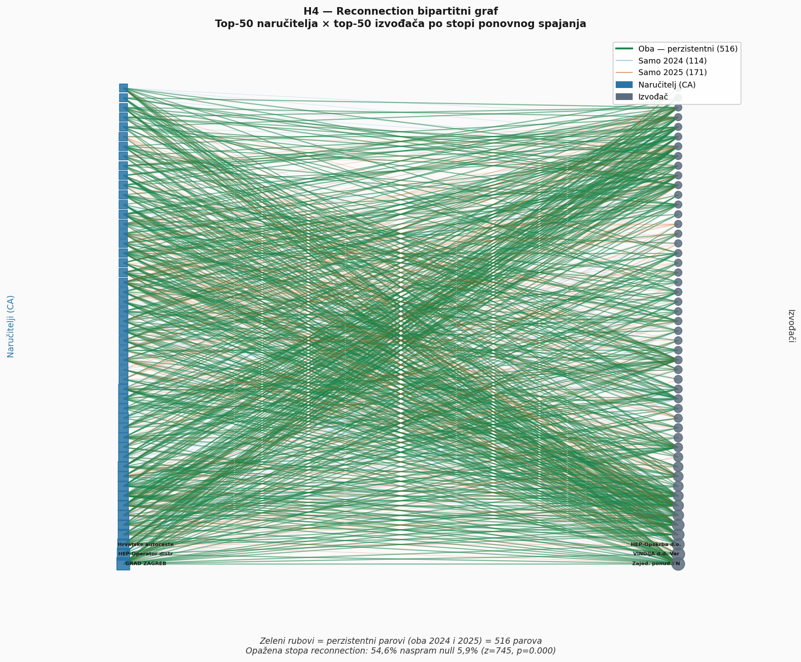
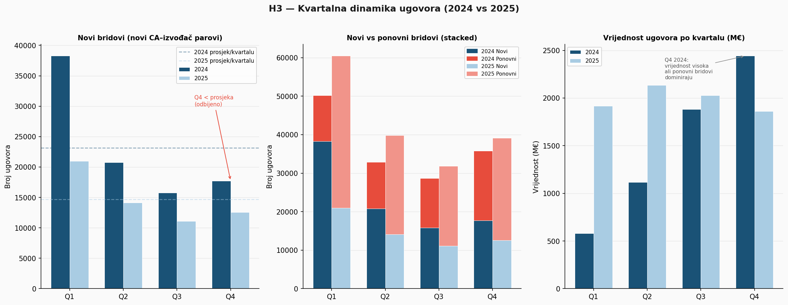
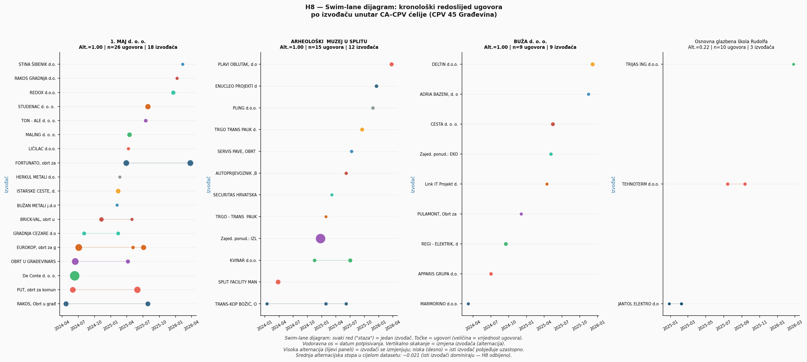
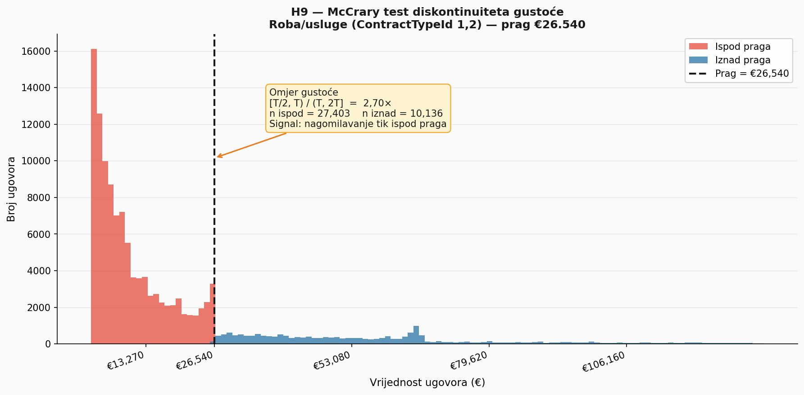
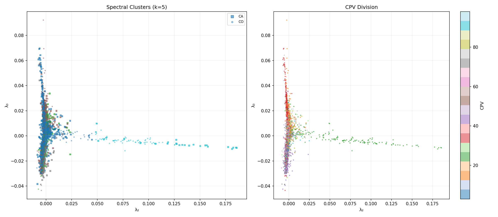

# Analiza mreže javne nabave Republike Hrvatske

## Pregled projekta — kolegij: Graph Networks

---

## Sažetak

Analizirali smo 383.374 ugovora javne nabave dodijeljenih u Hrvatskoj od početka 2024. do 10. svibnja 2026., preuzetih s portala EOJN (Elektronički oglasnik javne nabave). Dataset obuhvaća ukupnu vrijednost ugovora od oko 21,7 milijardi eura, ~4.200 naručitelja i ~44.000 izvođača. Koristeći bipartitne mreže i strukturirane null modele, testirali smo 15 hipoteza o koncentraciji tržišta, relacijskoj perzistentnosti, vremenskim anomalijama, strukturnom položaju, sektorskoj specijalizaciji, vremenskoj koordinaciji, izbjegavanju pragova, otpornosti mreže i institucionalnoj konvergenciji (H2 i H2a blokirane zbog nedostajućih geografskih podataka).

Potvrđene su četiri hipoteze:

- Portfeljni HHI izvođača premašuje null model u svih 45 sektora (višak +0,076, p=0,002).
- Parovi naručitelja i izvođača s prethodnim ugovorom u 2024. ostvaruju stopu ponovnog spajanja u 2025. koja je 9,2× viša od null-model očekivanja (z=745, p=0,000).
- Uspostavljeni odnosi povezani su s višim inflacijskim povećanjima vrijednosti ugovora putem aneksa u ugovorima najviše vrijednosti.
- Izvođači osvajaju ugovore u primarnom CPV sektoru češće nego što nasumična dodjela predviđa — stopa podudaranja 68,6% naspram null medijana od 5,7%.

Za eksploataciju je primijenjeno spektralno grupiranje na jezgri bipartitnog grafa (čvorovi stupnja ≥ 5: 9.856 čvorova, 99.857 bridova). Spektralni klasteri pokazuju 20,2× viši NMI s CPV sektorima od nasumične baze (NMI = 0,080 naspram 0,004; z = 182). Laplacian eigenmaps pruža 2D vizualizaciju strukturne sličnosti čvorova.

---

## 1. Uvod i kontekst

Javna nabava razlikuje se od privatnih tržišta: kupac (država) je ograničen administrativnim pravom, ishod je opažljiv, ali proces natjecanja često nije. To stvara dataset bogat relacijskim informacijama, a siromašan kompetitivnim — asimetrija koja omogućuje akumulaciju preferencijalnog pristupa kroz ugovorne prethodnice.

Obrazac ugovora koji odstupa od očekivanog pri kompetitivnoj dodjeli strukturni je signal vidljiv tek kada se ugovori analiziraju kao bridovi u relacijskoj mreži. Bipartitni graf (naručitelji × izvođači) omogućuje mjerenje distribucijskih svojstava — HHI, stope ponovnog povezivanja, Jaccardovog preklapanja — koja se ne mogu izračunati iz pojedinačnog ugovora.

**Hrvatski kontekst:** Prozor 2024.–2026. obuhvaća prvi puni ciklus nabave nakon ulaska u eurozonu (siječanj 2023.), s pragovima u eurima. ZJN 2016 postavlja prag za izravne dodjele: €26.540 za robu/usluge i €66.360 za radove. 78,6% ugovora pada ispod ovih pragova. Ukupna vrijednost nabave: ~€21,7 milijardi kroz ~2,5 godine (~10% BDP-a godišnje).

---

## 2. Podaci

**Izvor:** EOJN portal (https://eojn.nn.hr). Podaci prikupljeni programskim dohvatom iterativnim paginiranjem. Sirovih zapisa: 397.973; nakon čišćenja (`helpers/prepare_data.py`): 383.374 redaka, 52 stupca (`data/contracts_clean.csv`). Čišćenje uključuje deduplikaciju, filtriranje negativnih vrijednosti, parsiranje CPV kodova, zero-padding OIB-a i isključivanje ne-EUR valuta.

**Distribucija vrijednosti:**

| Statistika         | TotalValue (EUR bez PDV-a) |
| ------------------ | -------------------------- |
| Q1 (25. percentil) | €1.150                     |
| Medijan            | €4.955                     |
| Q3 (75. percentil) | €14.025                    |
| Srednja vrijednost | ~€56.600                   |
| Maksimum           | €397.981.460               |
| Suma               | ~€21,7 milijardi           |

Gornji decil čini 88,5% ukupne vrijednosti.

**Nedostajući podaci:** PayedAmount (58,9%), TerminationDate (59,9%) — onemogućena analiza kvalitete izvođenja i trajanja ugovora. Geografska polja (100%) — H2/H2a trajno blokirane. Zajedničke ponude nisu rastavljive (portal ne označava takve zapise) — metrike na razini čvorova su donje granice.

**Rad s cijelim skupom:** Dataset od 383.374 redaka i 46.037 čvorova analiziran je bez poduzorkovanja. Null-model permutacije zahtijevaju cijeli graf (distribucija stupnjeva mora biti očuvana), a hipoteze o tržišnoj strukturi zahtijevaju zatvorenu populaciju. Graf je rijedak (156.013 bridova, 46.037 čvorova, gustoća 9,00×10⁻⁴) što omogućuje efikasnu sparse reprezentaciju. Null iteracije ograničene na 500; betweenness računata aproksimativno (Brandes, 50 izvorišta, degree ≥ 5); Chung-Lu aproksimacija korištena za vjerojatnosti na razini parova.

---

## 3. Metodologija

### 3.1 Bipartitni graf

G = (U ∪ V, E), U = naručitelji, V = izvođači. Bridovi postoje samo između različitih skupova. Čuva prirodnu strukturu ugovora; projekcija na unipartitnu mrežu koristi se samo kada metrika to zahtijeva.

### 3.2 Multigraf

Između istog para čvorova može postojati više bridova (višestruki ugovori). Kolaps na jednostavni graf uništava vremensku i vrijednosnu informaciju — radimo s multigrafom osim za metrike koje zahtijevaju jednostavni graf (betweenness, Jaccard).

### 3.3 Null modeli

Referentni model koji opisuje što bismo opažali da je strukturna karakteristika nastala slučajem, uz zadana ograničenja. Pitanje je uvijek: premašuje li opaženo svojstvo ono što bi distribucija stupnjeva producirala?

### 3.4 Bipartitni konfiguracijski model

Čuva distribuciju stupnjeva svih čvorova, nasumično permutira bridove. 500 iteracija daje null distribuciju iz koje računamo očekivanu vrijednost i p-vrijednost. Kontrolira za volumenske efekte — ako naručitelj ima 100 ugovora, a izvođač 50, ponovno spajanje je djelomično statistički neizbježno.

### 3.5 Chung-Lu aproksimacija

Analitička procjena vjerojatnosti veze: P(u, v) ≈ (deg(u) × deg(v)) / |E|. Koristi se za procjene na razini parova bez pokretanja pune permutacije (H4).

### 3.6 Ginijev koeficijent

Mjera nejednakosti distribucije (0 = jednakost, 1 = potpuna koncentracija). Mjerimo nejednakost vrijednosti ugovora po izvođačima.

### 3.7 Herfindahl-Hirschman indeks (HHI)

HHI = Σ sᵢ², mjera koncentracije na razini čvora. Za izvođača mjeri koliko je prihod koncentriran na pojedine naručitelje (HHI ≈ 1 = gotovo sav prihod od jednog naručitelja).

### 3.8 Jaccardova sličnost

J(A, B) = |A ∩ B| / |A ∪ B|. Mjeri preklapanje klijentskih portfelja izvođača (H11, H12).

### 3.9 Betweenness centralnost

C_B(v) = Σ_{s≠v≠t} σ(s,t|v) / σ(s,t). Čvorovi s visokim betweennessom mostovi su između klastera. Korištena u H13 za testiranje pozicijske prednosti; računata aproksimativno (Brandes, 50 izvorišta, degree ≥ 5).

### 3.10 Spearmanov koeficijent korelacije

Mjera monotoničke asocijacije na rangovima. Korišten umjesto Pearsona zbog asimetričnih distribucija (H13).

### 3.11 McCrary test diskontinuiteta

Testira anomalni skok u gustoći distribucije na zadanom pragu. Korišten u H9 za detekciju cijena svjesnih praga (€26.540).

### 3.12 Bonferronijeva korekcija

α_korigiran = α / m. Kontrolira stopu lažnih pozitivnih pri višestrukim testovima. Primijenjena na sektorske testove (45 sektora, α* = 0,05/45).

### 3.13 CPV kodovi

EU standardni 8-znamenkasti kodovi. Divizija = prve dvije znamenke (45 = građevina, 33 = medicina, itd.). Svaki izvođač ima primarni CPV — sektor s najviše ugovora. 45 divizija korišteno za sektorsku segmentaciju.

### 3.14 z-ocjena

z = (opažena − null_mean) / null_sd. Standardizirano odstupanje od null-model očekivanja (npr. z=745 za H4).

### 3.15 Efektni prag

Svaka hipoteza specificira minimalno odstupanje od null modela koje se smatra supstancijalno značajnim, odvojeno od statističke značajnosti. S 383.000 ugovora i trivijalna odstupanja postižu statističku značajnost. Npr. Ginijev višak +0,039 je statistički značajan (p=0,002), ali ispod efektnog praga 0,05.

### 3.16 Spektralno grupiranje

Particioniranje grafa korištenjem svojstvenih vektora Laplaceove matrice. Primijenjeno na jezgri grafa (degree ≥ 5, 9.856 čvorova). Normalizirani bipartitni Laplacian omogućuje simultano embeddiranje oba tipa čvorova. Evaluacija putem NMI-ja s CPV sektorima.

### 3.17 Laplacian eigenmaps

Redukcija dimenzionalnosti uz očuvanje lokalne strukture susjedstva. Korišteno za 2D vizualizaciju strukturne sličnosti čvorova (λ₂, λ₃).

---

## 4. Eksploracija grafa

Eksploracija obuhvaća standardne topološke mjere koje karakteriziraju globalnu strukturu nabavne mreže.

### 4.1 Osnovne topološke mjere

Bipartitni jednostavni graf (kolaps multigrafa):

| Mjera                      | Vrijednost                    |
| -------------------------- | ----------------------------- |
| Broj čvorova               | 46.037 (4.138 CA + 41.899 CO) |
| Broj bridova (jednostavni) | 156.013                       |
| Broj bridova (multigraf)   | 383.374                       |
| Povezane komponente        | 51 (divovska: 99,7% čvorova)  |
| Gustoća                    | 9,00×10⁻⁴                     |
| Dijametar                  | 11                            |

### 4.2 Distribucija stupnjeva

**Naručitelji:** medijan = 15, sredina = 39,7, maksimum = 1.520.
**Izvođači:** medijan = 1, sredina = 5,55, maksimum = 1.520. 54,6% izvođača ima točno jednog naručitelja; 16,0% ima ≥ 5.

Log-log distribucija stupnjeva izvođača prati power-law s α = 2,16 (xmin = 21), karakteristično za scale-free mreže.



### 4.3 Koeficijent klasteriranja

Robins-Alexanderov bipartitni koeficijent: 0,022 — nizak, očekivano za rijetku bipartitnu mrežu.

### 4.4 Centralnost

Četiri mjere na divovskoj komponenti (45.908 čvorova):

| Mjera                          | Srednja (CA) | Srednja (CO) |
| ------------------------------ | ------------ | ------------ |
| Degree                         | 0,0009       | 0,0001       |
| Closeness (uzorak 100)         | 0,291        | 0,250        |
| Eigenvector                    | 0,007        | 0,001        |
| Betweenness (k=25)             | 0,0005       | ~0           |

Sve distribucije su izrazito asimetrične — mali broj čvorova dominira svim dimenzijama centralnosti.



### 4.5 Modularnost i zajednice

Louvain algoritam na CA–CA projekciji (1.713.177 bridova): 64 zajednice, modularnost Q = 0,150, NMI s CPV sektorima = 0,169. Slaba struktura zajednica — naručitelji dijele izvođače kroz fluidne, preklapajuće skupine.

### 4.6 Vizualizacija

Sve vizualizacije generirane programski (Matplotlib + NetworkX): bipartitni grafovi po sektoru (H1d), ego-mreže (H1a), reconnection graf (H4), swim-lane rotacija (H8), kvartalna dinamika (H3), distribucije stupnjeva i centralnosti.

---

## 5. Hipoteze i rezultati

### H1 — Koncentracija portfelja izvođača

**Mehanizam:** Jesu li prihodi izvođača više koncentrirani na manji broj naručitelja nego što tržišna veličina predviđa?

**Test:** Agregirana Gini nejednakost i srednji HHI po izvođačima, nasuprot bipartitnom konfiguracijskom modelu (500 permutacija).

**Rezultat:**
- Gini višak: +0,039 (p=0,002), ispod efektnog praga 0,05 → **nije potvrđeno**
- HHI višak: +0,076 (p=0,002), u svih 45 sektora → **POTVRĐENO**

**Interpretacija:** Prihod izvođača koncentriran je na 1–2 specifična naručitelja više nego što broj klijenata predviđa.

**H1a:** Udio naručitelja koji sve ugovore dodjeljuju jednom izvođaču: višak +2,1 pp, ispod praga 10 pp → nije potvrđeno.


**H1b — Diskrecijski postupci:** Label-permutacijski null model (miješanje oznake vrste postupka unutar CPV sektora). Ne potvrđuje se na agregiranoj razini; klasifikacija vrste postupka nije dovoljno pouzdana. → nije potvrđeno.

**H1c — EU nadzor:** Label-permutacijski null model (EU/domestic oznaka). 2 od 41 sektora potvrđuju; nema tržišno-širokog signala. → nije potvrđeno.

**H1d — Sektorski monopol:** Udio C1/C2 izvođača po sektoru, Bonferroni korekcija (α* = 0,05/45). Povišena koncentracija u CPV 9, 60, 64, 66, ali niti jedan sektor ne preživljava korekciju. → nije potvrđeno.


---

### H4 — Relacijska perzistentnost

**Mehanizam:** Predviđa li prethodna veza naručitelja i izvođača budući ugovor?

**Test:** Stopa ponovnog povezivanja 2024→2025 naspram Chung-Lu očekivane stope (kontrolira za stupnjeve oba aktera).

**Rezultat:** Opaženo 54,6% naspram null 5,9% (z=745, p=0,000). Multiplikator 9,2× u svih 45 sektora. **POTVRĐENO.**

**Interpretacija:** Kontrolirajući za volumen, prethodni ugovor predviđa buduće spajanje s 9,2× višom stopom.



---

### H4a — Inflacija vrijednosti aneksima

**Mehanizam:** Pokazuju li uspostavljeni CA–izvođač parovi višu inflaciju putem aneksa?

**Test:** Usporedba inflacijskog omjera (TotalValue/InitialValue) u gornjem kvartilu vrijednosti, uspostavljeni vs. prvi ugovori. Bipartitni konfiguracijski model.

**Rezultat:** Višak +75,12 (p=0,002). Signal koncentriran u ugovorima najviše vrijednosti. **POTVRĐENO.**

**Napomena:** Aneksi su rijetki ukupno (2,30% ugovora ima TotalValue > 1,01 × InitialValue).

---

### H6 — Sektorska specijalizacija (CPV homofilija)

**Mehanizam:** Osvajaju li izvođači ugovore u primarnom CPV sektoru češće od nasumične dodjele?

**Test:** Udio ugovora gdje primarni CPV izvođača odgovara CPV ugovora, nasuprot label-permutacijskom null modelu.

**Rezultat:** Stopa podudaranja 68,6% naspram null medijana 5,7% (višak +62,8 pp, p=0,002). Za visoko specijalizirane (≥70% u jednom sektoru): +81,2 pp. **POTVRĐENO.**

**Interpretacija:** Sektorska specijalizacija je dominantni prediktor (~12×). Relacijska prednost ne prenosi se između sektora.

---

### H10 — Otpornost mreže

**Mehanizam:** Ostaju li naručitelji bez izvođača nakon uklanjanja vrhovnih izvođača?

**Test:** Broj izoliranih naručitelja nakon ciljanog uklanjanja top-10 izvođača po vrijednosti, naspram nasumičnog uklanjanja.

**Rezultat:** 4 naručitelja izolirana; null medijan 0; efektni prag 207. **ODBIJENO.**

**Interpretacija:** Koncentracija vrijednosti ne prevodi se u ekskluzivnost pristupa — naručitelji zadržavaju alternativne izvođače.

---

### H11 — Institucionalna konvergencija

**Mehanizam:** Dijele li naručitelji iste CPV domene iste izvođače?

**Test:** Srednja Jaccardova sličnost unutar CPV-domene, nasuprot bipartitnom konfiguracijskom modelu.

**Rezultat:** Jaccard 0,0148 naspram null 0,0180 (višak −0,003, p=1,000). **ODBIJENO.**

**Interpretacija:** Distribucija stupnjeva nadpredviđa unutar-grupno preklapanje — nema institucionalnog kopiranja.

---

### H12 — Rich club fenomen

**Mehanizam:** Dijele li vrhovni izvođači zajednički skup naručitelja?

**Test:** Srednja Jaccardova sličnost klijentskih portfelja gornjeg 1% izvođača po snazi.

**Rezultat:** Jaccard 0,01604 naspram null 0,00893 (višak +0,007, p=0,002). Ispod efektnog praga 0,05. **ODBIJENO.**

**Interpretacija:** Vrhovni izvođači dominiraju zasebnim klasterima — konzistentno s H6.

---

### H13 — Strukturne rupe (Betweenness i inflacija)

**Mehanizam:** Imaju li izvođači s visokim betweennessom višu inflaciju aneksima?

**Test:** Spearmanova korelacija između betweenness centralnosti i inflacijskog omjera, naspram permutacije oznaka.

**Rezultat:** ρ=0,222 naspram null 0,247 (višak −0,025, p=1,000). **ODBIJENO.**

**Interpretacija:** Strukturna pozicija ne dodaje prediktivnu snagu iznad distribucije stupnjeva.

---

### H3 — Vremenski skok na kraju fiskalne godine

**Mehanizam:** Pokazuje li Q4 povišenu stopu novih CA–izvođač veza?

**Test:** Omjer novih bridova u Q4 naspram null modela ravnomjerne distribucije (1/4 godišnjeg totala po kvartalu).

**Rezultat:** Omjer Q4 novih bridova 0,77 (2024) i 0,85 (2025) — ispod prosjeka. Povišena vrijednost Q4 2024 dolazi od ponovljenih ugovora u etabliranim parovima. **NIJE POTVRĐENO.**



---

### H8 — Rotacija izvođača unutar CA–CPV ćelija

**Mehanizam:** Mijenja li se pobjednički izvođač u susjednim ugovorima unutar iste ćelije?

**Test:** Stopa alternacije unutar (naručitelj, CPV divizija) ćelija naspram permutirane sekvence pobjednika.

**Rezultat:** 49 od 13.545 ćelija (0,36%) — ispod 5% lažno pozitivne stope. Srednja alternacija −0,021. **NIJE POTVRĐENO.**

**Interpretacija:** Isti izvođači pobjeđuju uzastopno — relacijska perzistentnost na razini ćelija.



---

### H9 — Izbjegavanje pragova

**Mehanizam:** Dijele li naručitelji ugovore namjerno ispod zakonskog praga €26.540?

**Test:** (1) McCrary test diskontinuiteta gustoće na pragu. (2) Vremenski razmak uzastopnih ugovora istog para — test par-razine.

**Rezultat:**
- McCrary: omjer gustoće 2,70 za robu/usluge — signal cijena svjesnih praga.
- Par-razina: 12 od 50.000 parova (0,02%), p=1,000 — nije potvrđeno.

**Interpretacija:** Individualno određivanje cijena ispod praga postoji, ali sustavno sekvencijalno dijeljenje nije detektabilno.



---

## 6. Sinteza i zaključak

### Potvrđeni nalazi

Četiri potvrđene hipoteze konzistentne su s relacijskom perzistentnošću unutar sektorskih granica:

- **H6** (sektorska specijalizacija, +62,8 pp nad null) — tržište vrednuje sektorsku kompetenciju.
- **H4** (relacijska perzistentnost, 9,2×) — prethodni ugovor je najjači prediktor budućeg, unutar sektora.
- **H1 HHI** (koncentracija portfelja, +0,076) — prihod izvođača koncentriran na mali broj naručitelja.
- **H4a** (inflacija aneksima u najvećim ugovorima) — uspostavljeni odnosi povezani s povećanjem vrijednosti.

Ovi nalazi su međusobno konzistentni, ali ne konstituiraju uzročni lanac.

### Odbijeni nalazi preciziraju mehanizam

- **H10** (otpornost): Tržište nije fragilno — naručitelji imaju alternative.
- **H8** (rotacija): Nema kartelske koordinacije na razini ćelija.
- **H9 par-razina** (dijeljenje ugovora): Nema sustavne evazije pragova (iako McCrary potvrđuje cijene svjesne praga).
- **H12** (rich club): Vrhovni izvođači zauzimaju zasebne niše, ne zajednički tier.
- **H13** (betweenness): Strukturna pozicija ne dodaje prediktivnu snagu iznad stupnja.
- **H11** (konvergencija): Nema institucionalnog kopiranja — distribucija stupnjeva objašnjava svu sličnost.

### Spektralna analiza

Spektralno grupiranje na jezgri grafa (9.856 čvorova, degree ≥ 5) identificira 5 klastera. NMI s CPV sektorima = 0,080 naspram nasumične baze 0,004 (z=182, 20,2×). Administrativna CPV podjela ima mjerljiv strukturni odraz, ali nije savršena — stvarni obrasci nabave presijecaju CPV granice, konzistentno s odbacivanjem H11. Laplacian eigenmaps pruža 2D vizualizaciju.



Ključni metodološki doprinos je primjena bipartitnog konfiguracijskog null modela za razlučivanje strukturnog signala od efekata tržišne veličine.

---

## 7. Eksploatacija — spektralna analiza (detalji)

### 7.1 Motivacija

Spektralno grupiranje odabrano je kao nenadgledana metoda za otkrivanje latentnih zajednica, komplementarna unaprijed definiranim hipotezama. Normalizirani bipartitni Laplacian omogućuje simultano embeddiranje naručitelja i izvođača bez gubitka informacije projekcijom. Evaluacija putem NMI-ja s CPV sektorima i nasumičnom bazom (100 ponavljanja).

### 7.2 Priprema i izračun

Filtriranje čvorova s degree < 5 (pun graf daje degeneriranu particiju):

| Mjera              | Puni graf | Jezgra (deg ≥ 5) |
| ------------------ | --------- | ---------------- |
| Broj CA            | 4.138     | 3.164            |
| Broj CO            | 41.899    | 6.692            |
| Ukupno čvorova     | 46.037    | 9.856            |
| Broj bridova       | 156.013   | 99.857           |

Spektralno grupiranje: k=5 (eigengap heuristika sugerira k=1 — degeneriran rezultat; k=5 odabran za interpretabilnu granularnost). k-means na prvih 5 svojstvenih vektora. Laplacian eigenmaps: λ₂, λ₃ za 2D koordinate.

### 7.3 Rezultati

| Klaster | CA  | CO   | Ukupno | Dominantni CPV            |
| ------- | --- | ---- | ------ | ------------------------- |
| 0       | 1.719 | 4.986 | 6.705  | 45, 71, 50                |
| 1       | 389 | 562   | 951    | 45, 71, 15                |
| 2       | 758 | 681   | 1.439  | 15, 45, 71                |
| 3       | 271 | 397   | 668    | 45, 71, 79                |
| 4       | 27  | 66    | 93     | 22 (tisak)                |

NMI(spektralno, CPV) = 0,080; NMI(nasumično, CPV) = 0,004 ± 0,0004; z=182.

### 7.4 Ograničenja eksploatacije

- Filtriranje deg < 5 uklanja 78,6% čvorova — rezultati vrijede za jezgru tržišta.
- Nema ground-truth oznaka; evaluacija ograničena na NMI s CPV sektorima.
- Izbor k=5 je diskrecioni (eigengap sugerira k=1).

---

## 8. Ograničenja

| Ograničenje                              | Utjecaj                        |
| ---------------------------------------- | ------------------------------ |
| Samo podaci o ishodima (nema natječaja)  | Sve hipoteze — null modeli apsorbiraju efekte stupnjeva |
| Prozor 2024.–2026. (dvije godine)        | Trendne tvrdnje onemogućene    |
| ProcedureTypeId neprovjerena oznaka      | H1b, H8 — eksploratorni status |
| Geografska polja 100% nedostaju          | H2, H2a trajno blokirane       |
| PayedAmount 58,9%, TerminationDate 59,9% | Analiza kvalitete/trajanja nije izvediva |
| Strani izvođači: nekoherentni OIB        | 1,1% bridova isključeno        |
| Kauzalnost nije uspostavljena            | Odstupanje od null modela konzistentno je s mehanizmom, ne dokazuje ga |
| Nema ground-truth oznaka                 | Eksploatacija evaluirana samo putem NMI-ja s CPV |
| Filtriranje jezgre (deg ≥ 5)             | Rezultati spektralne analize vrijede za jezgru, ne za cijelu populaciju |

---

## 9. Metodološke bilješke po hipotezama

- **H1:** Bipartitni konfiguracijski model — čuva volumen izdavanja i broj pobjeda, permutira parove.
- **H1a:** Isti null model; McNemarov test za smjer promjene udjela zarobljenih naručitelja 2024→2025.
- **H1b:** Label-permutacijski model — miješa oznaku vrste postupka unutar sektora.
- **H1c:** Label-permutacijski model — miješa EU/domestic oznaku unutar sektora.
- **H1d:** Bipartitni konfiguracijski model; Bonferroni na 45 sektora (α* = 0,05/45).
- **H3:** Klasifikacija bridova (novi/ponovni); stacionarni Poissonov null model.
- **H4:** Chung-Lu bipartitna aproksimacija; z-score test naspram Poisson-binomne sume.
- **H4a:** Bipartitni konfiguracijski model; status prethodnog odnosa dodijeljen strukturno.
- **H6:** Label-permutacijski model — primarni CPV izvođača randomiziran, parovi očuvani.
- **H8:** Permutacija sekvence unutar ćelije; tržišna razina testirana Binom(n, 0,05).
- **H9:** McCrary test diskontinuiteta; vremenska permutacija unutar para za test par-razine.
- **H10:** Ciljano naspram nasumičnog uklanjanja čvorova.
- **H11:** Bipartitni konfiguracijski model; srednja Jaccardova sličnost unutar CPV grupa.
- **H12:** Srednja Jaccardova sličnost gornjeg 1% izvođača.
- **H13:** Spearmanova korelacija; permutacija oznaka betweenness centralnosti.

---

## 10. Reproducibilnost

Sve analize izvršavaju se iz korijenskog direktorija:

```bash
python helpers/prepare_data.py          # Čišćenje
python analysis/exploration.py           # Eksploracija
python analysis/h1_concentration.py      # Hipoteze (svaka neovisna)
python analysis/exploitation_spectral.py # Eksploatacija
```

Svaka skripta učitava `data/contracts_clean.csv`, primjenjuje standardne filtre, izvršava 500 null-model iteracija i ispisuje rezultate u `results/`.

Licenca: CC BY-NC-ND 4.0.
