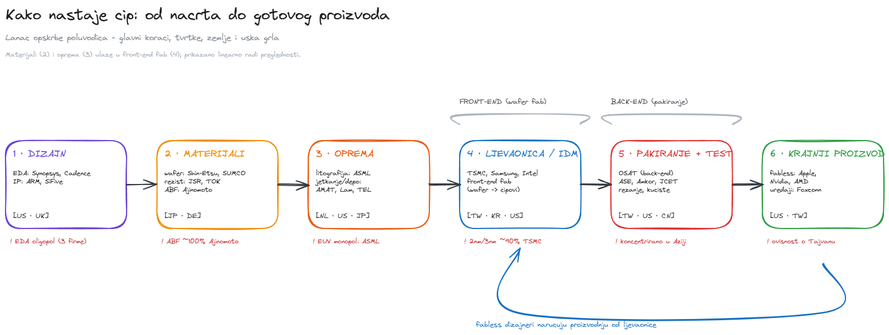
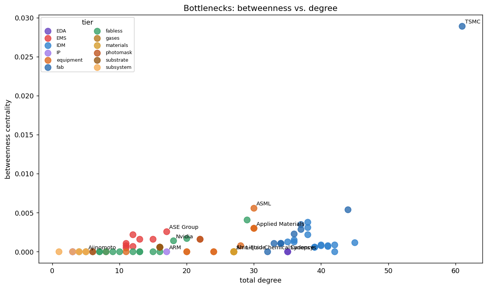
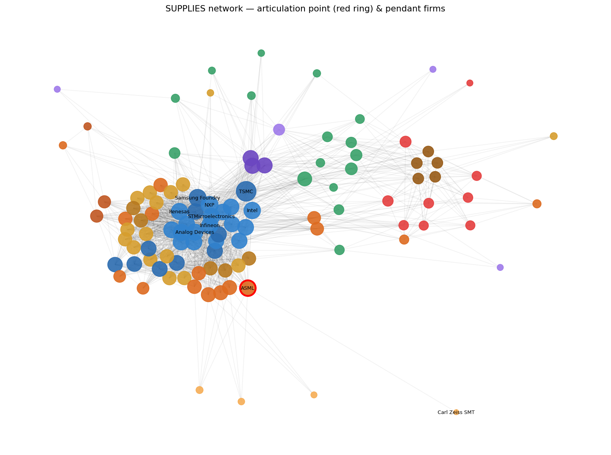
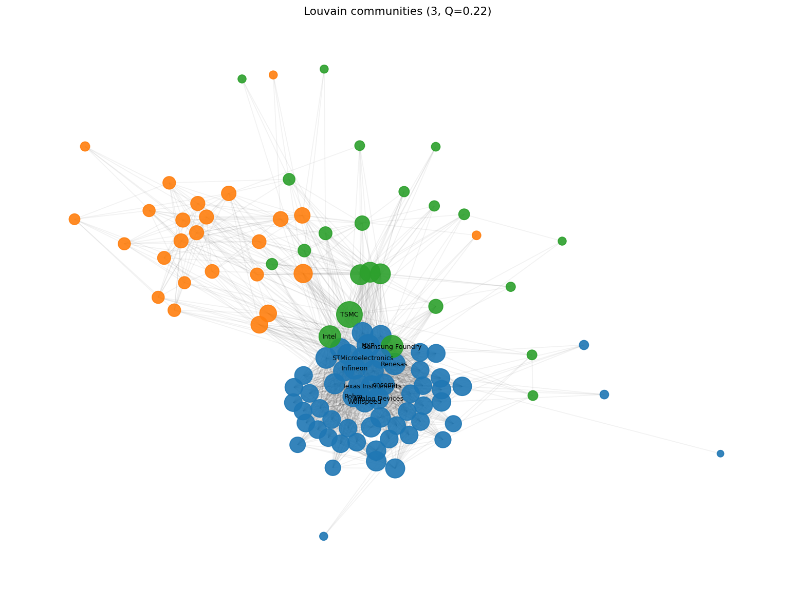
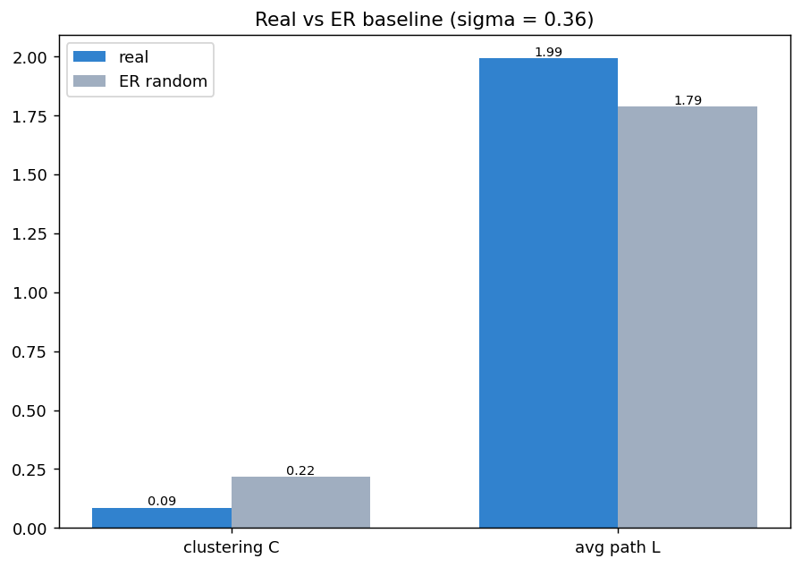
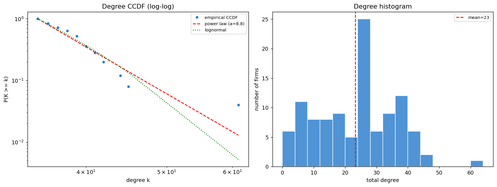
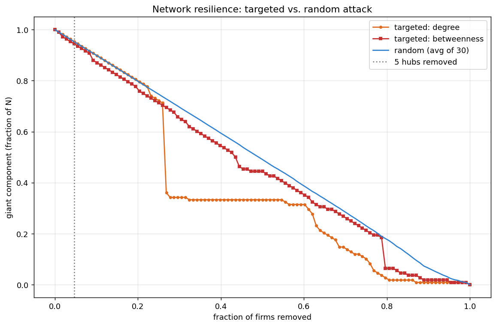
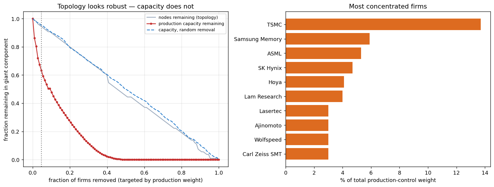
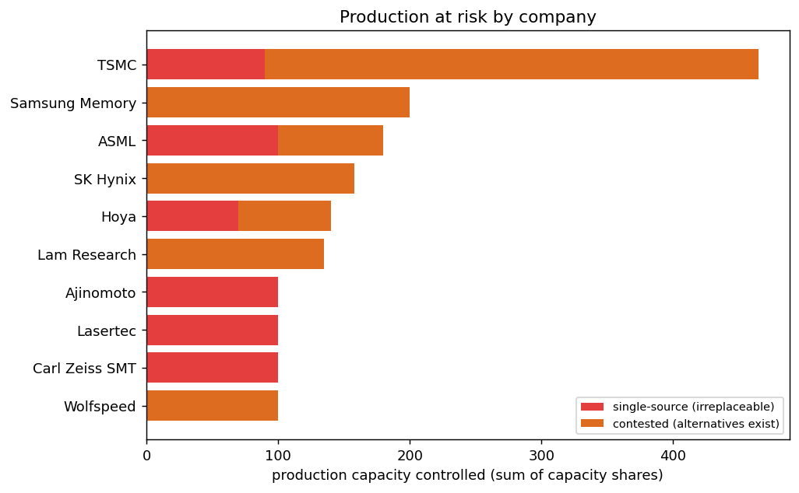
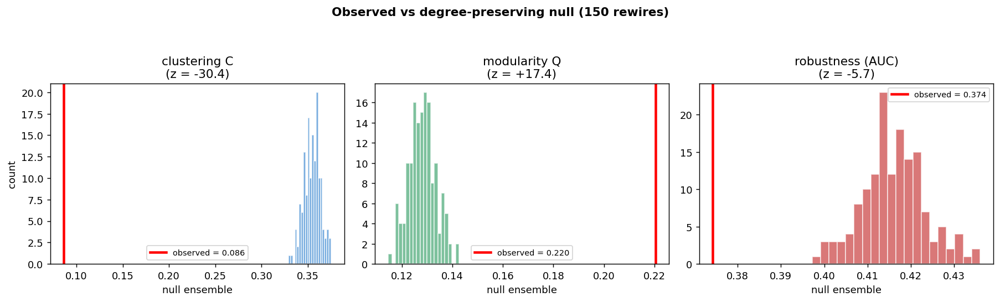

# 🌐 Lanac opskrbe poluvodiča — analiza mreže

**Projekt iz kolegija Analiza mreža — PMF-UNIST, 2025/2026**

Globalni lanac opskrbe poluvodiča (čipova) modeliramo kao **graf**, pohranjujemo
ga u **Neo4j**, zrcalimo u **NetworkX** i provodimo analizu mreže koja pokriva sve
glavne teme kolegija (L2–L9) te dva proširenja: **koncentraciju proizvodnje** i
**null-model testiranje značajnosti**.

Ovaj README je **cjeloviti izvještaj** projekta. Interaktivna inačica s kodom je
`notebooks/00_master_walkthrough.ipynb`; dublje analize po temama su u
`notebooks/01`–`09`.

---

## Hipoteza

> *„Lanac opskrbe poluvodiča je ultra-krhka **scale-free** mreža u kojoj uklanjanje
> 3–5 čvorova-čvorišta (TSMC, ASML, Shin-Etsu, Air Products i jedan veliki ARM
> licencar) uzrokuje **katastrofalnu fragmentaciju** velike povezane komponente,
> modelirajući stvarnu krizu čipova 2020.–2022.“*

Kroz izvještaj **provjeravamo svaki dio te tvrdnje** i donosimo pošten zaključak —
uključujući dijelove gdje podaci hipotezu **opovrgavaju**.

## Sadržaj

1. [Uvod u temu — kako nastaje čip](#1-uvod-u-temu--kako-nastaje-čip-i-tko-ga-radi)
2. [Model grafa i podaci](#2-model-grafa-i-podaci)
3. [L2 — Osnovna svojstva](#3-l2--osnovna-svojstva-grafa)
4. [L3 — Centralnost](#4-l3--centralnost-tko-su-uska-grla)
5. [L4 — Povezanost](#5-l4--povezanost-artikulacijske-točke)
6. [L5 — Zajednice](#6-l5--zajednice-tierovi-ne-teritoriji)
7. [L6/L7 — Slučajni model i small-world](#7-l6l7--slučajni-model-er-i-small-world)
8. [L8 — Scale-free?](#8-l8--je-li-mreža-scale-free)
9. [L9 — Otpornost](#9-l9--otpornost-ciljani-vs-slučajni-napad)
10. [Proširenje — koncentracija](#10-proširenje--koncentracija-i-težinska-otpornost)
11. [Proširenje — null-modeli](#11-proširenje--null-model-testiranje)
12. [Sinteza i zaključak](#12-sinteza-i-konačni-zaključak)
13. [Ograničenja](#13-ograničenja-modela)
14. [Reprodukcija i struktura](#14-reprodukcija-i-struktura-repozitorija)

---

## 1. Uvod u temu — kako nastaje čip i tko ga radi

Moderni **čip** je možda najsloženiji proizvod koji čovječanstvo radi. Nijedna
tvrtka ni država ne može sama napraviti napredni čip — stotine specijaliziranih
tvrtki iz desetak zemalja surađuju u dugom nizu koraka. Taj **niz međuovisnosti**
modeliramo kao mrežu. Tipičan napredni čip „prijeđe svijet“ više puta: dizajn u
SAD-u/UK, oprema iz Nizozemske, materijali iz Japana, proizvodnja na Tajvanu,
pakiranje u Kini. Zbog te specijalizacije i geografske koncentracije lanac je
**moćan, ali i ranjiv**.

**Slojevi (tierovi) igrača:** EDA/IP (alati i nacrti za dizajn), materijali i
kemikalije (wafer, fotorezist, plinovi, ABF film), oprema (litografija, jetkanje,
depozicija), ljevaonice/IDM/fabless (proizvodnja), te OSAT/EMS (pakiranje i
ugradnja).



| Korak | Što se događa | Ključne tvrtke | Zemlje | Materijali / alati |
|---|---|---|---|---|
| **Dizajn** | logika čipa se projektira | Synopsys, Cadence, ARM, Nvidia, Apple | US, UK | EDA softver, IP jezgre |
| **Materijali** | sirovine za proizvodnju | Shin-Etsu, SUMCO, JSR, Ajinomoto | JP, DE | wafer, fotorezist, ABF, plinovi |
| **Oprema** | strojevi za front-end | ASML, Applied Materials, Lam, TEL, KLA | NL, US, JP | EUV/DUV litografija, jetkanje |
| **Ljevaonica/IDM** | wafer → čipovi (front-end) | TSMC, Samsung, Intel, GlobalFoundries | TW, KR, US | čista soba, stotine koraka |
| **Pakiranje+test** | rezanje, test, kućište (back-end) | ASE, Amkor, JCET | TW, US, CN | bonderi, podloge |
| **Krajnji proizvod** | čip u uređaju | Apple, Nvidia, AMD, Foxconn | US, TW | gotovi čipovi |

> Dijagram je uređiv: `reports/diagrams/chip_supply_chain.excalidraw` (otvori na
> [excalidraw.com](https://excalidraw.com)).

## 2. Model grafa i podaci

Graf ima **4 tipa čvorova** i **6 tipova veza**:

| Čvor | Broj | | Veza | Od → Do |
|---|---|---|---|---|
| `Company` | 108 | | `SUPPLIES` | Company → Company |
| `Product` | 68 | | `MANUFACTURES` | Company → Product |
| `Country` | 13 | | `LOCATED_IN` | Company → Country |
| `Facility` | 18 | | `OPERATES` | Company → Facility |
| | | | `COMPETES_WITH` | Company → Company |
| | | | `DEPENDS_ON` | Product → Product |

Cijeli graf: **207 čvorova**, ~1.6k veza. Glavnina analize radi na **projekciji
SUPPLIES** (108 tvrtki, 1256 bridova nakon sažimanja paralelnih veza).

**Tok podataka i pravilo izvora:** `CSV (data/raw)` → `Neo4j` → `graph.pkl`
(NetworkX, ono što bilježnice učitavaju). Svaka `SUPPLIES` i `MANUFACTURES` veza
**mora** imati `source_url` + `source_date`; to forsira `scripts/04_validate.py`.
Izvori: financijska izvješća (10-K/20-F), SEMI/WSTS, TrendForce, World Bank, IMF.

## 3. L2 — Osnovna svojstva grafa

Mreža je rijetka (mali udio mogućih veza), ali s nekoliko vrlo povezanih
čvorišta — prvi nagovještaj „hub“ strukture. Prosječan stupanj ≈ 23, maksimalni
61. Projekcija SUPPLIES je **jedna povezana, aciklična (DAG)** cjelina — oblik
pravog lanca opskrbe (uzvodno → nizvodno).

## 4. L3 — Centralnost (tko su uska grla?)

Računamo više mjera koje se namjerno **ne slažu**: stupanj (izravan doseg),
**betweenness** (posredništvo), closeness i eigenvector/pagerank (utjecaj).

- **Vrh betweennessa:** **TSMC**, zatim ASML, Samsung Foundry, Apple, SK Hynix.
- **Vrh out-stupnja:** uzvodni omogućivači koji prodaju cijeloj industriji — EDA
  (Cadence, Synopsys) i oprema (ASML, KLA).
- **TSMC** je pivot: visok i po *ulaznom* stupnju i po posredništvu — upija
  uzvodni lanac i hrani gotovo sve fabless dizajnere.



## 5. L4 — Povezanost (artikulacijske točke)

- **Komponente:** 1 (graf je povezan), i **acikličan (DAG)**.
- **Artikulacijska točka:** točno **jedna — ASML**, spojena jednim **mostom** na
  svog jedinog dobavljača EUV-optike (Carl Zeiss SMT, viseći čvor).
- **Globalna povezanost čvorova κ = 1** → jedno dobro odabrano uklanjanje *može*
  rascijepiti graf. Inače je mreža redundantna (svaki sloj ima više dobavljača).



## 6. L5 — Zajednice (tierovi, ne teritoriji)

Louvain nalazi **3 zajednice** uz modularnost **Q ≈ 0.22**. Ključno:

- **Modularnost po tieru je negativna** (Q ≈ −0.15) → tvrtke istog tipa se
  međusobno gotovo **ne** opskrbljuju: potpis **višedijelne (multipartite)** mreže.
- **Geografija je tek slabo modularna** (Q ≈ 0.03) — opskrba je globalna.

Mrežu dakle organizira **uloga u lancu**, ne država.



## 7. L6/L7 — Slučajni model (ER) i small-world

Usporedba sa slučajnim Erdős–Rényi grafom istog broja čvorova i veza:

| | Grupiranje C | Prosj. put L |
|---|---|---|
| **Stvarno** | 0.086 | 1.99 |
| **ER** | 0.218 | 1.79 |

**σ ≈ 0.36.** Putovi su kratki (≈ 2 koraka), ali grupiranje je **ispod**
slučajnog → mreža **nije** klasičan small-world. Razlog je višedijelna struktura:
dobavljači nekog čvora rijetko opskrbljuju jedni druge (nema „trokuta“).



## 8. L8 — Je li mreža scale-free?

Distribucija stupnjeva **jest** desno-zakrivljena s jasnim hubovima, ali formalni
test (`powerlaw`) pokazuje da **power-law nije statistički bolji od lognormalne**
(p ≫ 0.05). Na ovako maloj i gustoj mreži ne možemo tvrditi „scale-free“ — pošten
opis je „dominirana hubovima i teško-repna“. **Ovaj dio hipoteze ne prolazi.**



## 9. L9 — Otpornost (ciljani vs slučajni napad)

Uklanjamo čvorove i pratimo veliku povezanu komponentu (GCC):

- Ciljani napad (po stupnju/betweennessu) **jest** razorniji od slučajnog —
  potpis hub-ovisne mreže.
- **Ali** uklanjanje 5 imenovanih hubova ostavlja **~94 %** tvrtki povezano →
  **nema** katastrofalne fragmentacije. Na razini tvrtki mreža je robusna zbog
  redundancije.



> Topološki test broji samo čvorove, ne i *koliko* svaki proizvodi — taj
> nedostatak ispravljamo u sljedećem poglavlju.

## 10. Proširenje — koncentracija i težinska otpornost

Čvor kroz koji ide 80 % proizvodnje i onaj s 5 % izgledaju jednako topološki.
Dodajemo dimenziju **„koliko“** preko `capacity_share_pct` (udio kapaciteta,
osvježen tržišnim podacima 2024.):

- **~15 single-source proizvoda** (jedini proizvođač): EUV litografija → **ASML**,
  EUV optika → **Carl Zeiss SMT**, EUV mask blank → **Hoya**, mask inspekcija →
  **Lasertec**, ABF film → **Ajinomoto**, 2nm → **TSMC**…
- **Top kontrolori kapaciteta:** TSMC (~13.7 % ukupnog), Samsung Memory, ASML,
  SK Hynix, Hoya.
- **Težinska otpornost:** uklanjanje 5 hubova ostavlja ~94 % *tvrtki*, ali samo
  **~74 % proizvodnog kapaciteta**; top-10 kontrolora → ~**50 %** izlaza.

„Robusnost“ je bila **artefakt** zanemarivanja količine. Prave točke loma su
**monopolski inputi**, ne cijele tvrtke.



**Production-at-risk po tvrtki** (kontrolirani kapacitet; crveno = nezamjenjivi
single-source dio):



## 11. Proširenje — null-model testiranje

Deskriptivne mjere ne kažu je li nešto *više nego slučajno*. Koristimo
**konfiguracijski null model uz očuvanje stupnjeva** (`nx.double_edge_swap`): svako
odstupanje opaženog od null-a = **prava struktura iznad same distribucije
stupnjeva**.

| Mjera | Opaženo | Null | z | Značajno? |
|---|---|---|---|---|
| grupiranje C | 0.086 | 0.355 | **−30** | da (ispod) |
| prosj. put L | 1.99 | 1.87 | **+21** | da |
| modularnost Q | 0.220 | 0.128 | **+18** | da |
| # artikulacijskih točaka | 1 | 1.0 ± 0.0 | **0** | **ne** |
| otpornost (degree napad) | 0.374 | 0.416 | **−6** | da (krhkije) |
| degree assortativity | −0.117 | −0.086 | **−1.4** | **ne** |

**4/6 svojstava je statistički značajno** (p < 0.001) — niska grupiranost, jača
modularnost i pojačana krhkost su **prava struktura**. Dva nisu: jedina
artikulacijska točka je **trivijalna posljedica jednog visećeg čvora** (svaki
degree-preserving graf također ima točno 1), a disasortativnost je objašnjiva
samom distribucijom stupnjeva. Upravo to je svrha null modela — razdvojiti pravu
strukturu od artefakta stupnjeva.



## 12. Sinteza i konačni zaključak

| Tvrdnja | Hipoteza kaže | Podaci pokazuju | Ocjena |
|---|---|---|---|
| Scale-free (L8) | power-law dominira | NE — lognormal jednako dobar | ✗ |
| Small-world (L7) | kratki putovi + visoko grupiranje | DJELOMIČNO — kratki putovi, nisko grupiranje | ~ |
| Nezamjenjivi hubovi (L4) | više kritičnih tvrtki | USKO — samo ASML | ~ |
| Hub-ovisnost (L9) | ciljani napad razorniji | DA | ✓ |
| Katastrofa od 5 hubova (L9) | raspad GCC-a | NE topološki (94 %); ALI 26 % kapaciteta nestane | ~ |
| Prava krhkost | na razini tvrtki | NE — na razini monopolskih inputa | ✗→✓ |

Podaci **djelomično potvrđuju, ali pročišćuju** hipotezu. Kritičnost je
koncentrirana uzvodno i mreža je osjetljiva na hubove, ali na razini *tvrtki* nije
ni čisto scale-free, ni klasičan small-world, ni katastrofalno krhka na 5 hubova.
**Prava krhkost je lokalizirana na monopolske tehnologije** (ASML/EUV, Zeiss/optika,
Hoya/mask blank, Ajinomoto/ABF) — što se vidi tek kad analizu **ponderiramo
proizvodnim kapacitetom**. To, a ne „scale-free kolaps“, je točan model krize
čipova 2020.–2022.

## 13. Ograničenja modela

- **Ručno kodiran graf (~108 tvrtki).** Backbone je ručno složen iz javnih izvora,
  pa dio rezultata dijelom odražava **modelarske odluke** — npr. jedina
  artikulacijska točka je, kako null-model i potvrđuje (z = 0), posljedica
  uključivanja točno jednog visećeg čvora.
- **Djelomični podaci o kapacitetu.** `capacity_share_pct` pokriva ~60 %
  `MANUFACTURES` bridova; „single-source“ znači *jedini proizvođač unutar
  modeliranih 100 tvrtki*.
- **Rijetki tvrtka→tvrtka volumeni.** `volume_share_pct` javan je za samo nekoliko
  veza, pa je težinska otpornost najjača na **proizvodnom** sloju.
- **Približne brojke** (tržišne kapitalizacije, udjeli) — javne aproksimacije,
  prikladne za strukturnu analizu, ne za točne financije.
- **Mala, gusta mreža** (108 čvorova) ograničava statističku snagu nekih testova.
- **Snimka, ne dinamika** — jedan vremenski presjek.

## 14. Reprodukcija i struktura repozitorija

```bash
pip install -r requirements.txt
```

Podaci i `data/processed/graph.pkl` su uključeni, pa **analiza radi odmah** — otvori
`notebooks/00_master_walkthrough.ipynb` i *Run All* (bilježnice učitavaju
`graph.pkl`, baza nije potrebna).

Ponovna izgradnja podataka od nule:

```bash
python scripts/01_collect_backbone.py     # piše data/raw CSV-ove
python scripts/02_collect_enrichment.py   # treba internet (World Bank + IMF)
python scripts/03_import_neo4j.py --all    # treba Neo4j + NEO4J_PASSWORD u .env
python scripts/04_validate.py              # provjera: svaki SUPPLIES/MANUFACTURES ima izvor
```

```
├── README.md                 ← ovaj izvještaj
├── CLAUDE.md                 ← detaljni radni dnevnik / status
├── requirements.txt
├── data/{raw, processed, sources.csv}
├── scripts/                  ← 01–04 pipeline, analysis.py, utils.py, make_excalidraw_diagram.py
├── notebooks/
│   ├── 00_master_walkthrough.ipynb   ← cijeli projekt (HR) — počni ovdje
│   ├── 01_graph_basics … 07_resilience
│   ├── 08_concentration.ipynb        ← težinska analiza / single-source rizik
│   └── 09_null_models.ipynb          ← null-model testiranje značajnosti
└── reports/{figures, diagrams}
```
